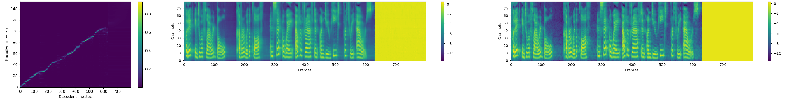

# Tacotron 2 (without wavenet)

Tacotron 2 PyTorch implementation of [Natural TTS Synthesis By Conditioning
Wavenet On Mel Spectrogram Predictions](https://arxiv.org/pdf/1712.05884.pdf). 

This implementation includes **distributed** and **fp16** support
and uses the [LJSpeech dataset](https://keithito.com/LJ-Speech-Dataset/).

Distributed and FP16 support relies on work by Christian Sarofeen and NVIDIA's
[Apex Library](https://github.com/nvidia/apex).

[Download demo audio](https://github.com/NVIDIA/tacotron2/blob/master/demo.wav) trained on LJS and using Ryuchi Yamamoto's [pre-trained Mixture of Logistics
wavenet](https://github.com/r9y9/wavenet_vocoder/)  
"Scientists at the CERN laboratory say they have discovered a new particle."

## Pre-requisites
1. NVIDIA GPU + CUDA cuDNN

## Setup
1. Download and extract the [LJ Speech dataset](https://keithito.com/LJ-Speech-Dataset/)
2. Clone this repo: `git clone https://github.com/NVIDIA/tacotron2.git`
3. CD into this repo: `cd tacotron2`
4. Update .wav paths: `sed -i -- 's,DUMMY,ljs_dataset_folder/wavs,g' filelists/*.txt`
    - Alternatively, set `load_mel_from_disk=True` in `hparams.py` and update mel-spectrogram paths 
5. Install [pytorch 0.4](https://github.com/pytorch/pytorch)
6. Install python requirements or build docker image 
    - Install python requirements: `pip install -r requirements.txt`
    - **OR**
    - Build docker image: `docker build --tag tacotron2 .` 

## Training
1. `python train.py --output_directory=outdir --log_directory=logdir`
2. (OPTIONAL) `tensorboard --logdir=outdir/logdir`

## Multi-GPU (distributed) and FP16 Training
1. `python -m multiproc train.py --output_directory=outdir --log_directory=logdir --hparams=distributed_run=True,fp16_run=True`

## Inference
When performing Mel-Spectrogram to Audio synthesis with a WaveNet model, make sure Tacotron 2 and WaveNet were trained on the same mel-spectrogram representation. Follow these steps to use a a simple inference pipeline using griffin-lim:

1. `jupyter notebook --ip=127.0.0.1 --port=31337`
2. load inference.ipynb 

## Related repos
[nv-wavenet](https://github.com/NVIDIA/nv-wavenet/): Faster than real-time
wavenet inference

## Acknowledgements
This implementation uses code from the following repos: [Keith
Ito](https://github.com/keithito/tacotron/), [Prem
Seetharaman](https://github.com/pseeth/pytorch-stft) as described in our code.

We are inspired by [Ryuchi Yamamoto's](https://github.com/r9y9/tacotron_pytorch)
Tacotron PyTorch implementation.

We are thankful to the Tacotron 2 paper authors, specially Jonathan Shen, Yuxuan
Wang and Zongheng Yang.

